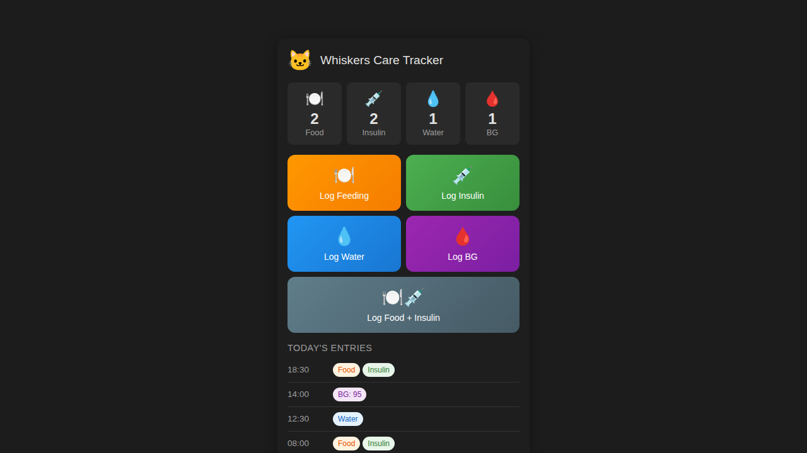

# Cat Care Tracker for Home Assistant

[](https://github.com/hacs/integration)

A custom Home Assistant integration for tracking cat care activities (feeding, insulin, water, blood glucose) with Google Sheets as the backend database.

## Features

- 🍽️ **Track Feedings** - Log when your cat is fed
- 💉 **Track Insulin** - Log insulin injections with timestamps
- 💧 **Track Water** - Log water bowl refills
- 🩸 **Track Blood Glucose** - Log blood glucose measurements

### Dashboard Card

A beautiful custom Lovelace card that shows:
- Today's counts for each activity type
- Quick action buttons for logging activities
- Recent entries timeline
- Blood glucose input modal

### Google Sheets Integration

All data is synced with your Google Sheets spreadsheet, matching your existing column structure:
- `Timestamp` - When the entry was added
- `Date` - The date/time of the activity
- `Checkin Type` - Multi-select (Food, Water, Insulin, Blood Glucose Measurement)
- `Water Refill` - Optional water amount
- `BG (mg/dL)` - Optional blood glucose level

## Installation

### HACS Installation (Recommended)

1. Make sure you have [HACS](https://hacs.xyz/) installed
2. Go to HACS → Integrations → Custom repositories
3. Add this repository URL: `https://github.com/adierkens/ha-google-sheets`
4. Select category: "Integration"
5. Install "Cat Care Tracker"
6. Restart Home Assistant

### Manual Installation

1. Copy the `custom_components/cat_care_tracker` folder to your Home Assistant's `custom_components` directory
2. Copy `www/community/cat-care-tracker-card.js` to your `www/community` directory
3. Restart Home Assistant

## Configuration

### Prerequisites

1. **Create a Google Cloud Project**
   - Go to [Google Cloud Console](https://console.cloud.google.com/)
   - Create a new project
   - Enable the Google Sheets API

2. **Create a Service Account**
   - Go to "APIs & Services" → "Credentials"
   - Click "Create Credentials" → "Service Account"
   - Download the JSON key file
   - Place it in your Home Assistant config directory (e.g., `/config/cat_care_tracker_credentials.json`)

3. **Share Your Google Sheet**
   - Open your Google Sheet
   - Click "Share"
   - Add the service account email (found in the JSON file as `client_email`)
   - Grant "Editor" access

### Setup in Home Assistant

1. Go to Settings → Devices & Services → Add Integration
2. Search for "Cat Care Tracker"
3. Enter:
   - **Google Spreadsheet ID**: The ID from your sheet URL (e.g., `https://docs.google.com/spreadsheets/d/YOUR_SPREADSHEET_ID/edit`)
   - **Credentials File Path**: Path to your service account JSON file
   - **Cat's Name**: Your cat's name (used for sensor naming)

### Add the Dashboard Card

1. Edit your dashboard
2. Add a new card
3. Select "Cat Care Tracker Card"
4. Configure:
   ```yaml
   type: custom:cat-care-tracker-card
   entity: sensor.YOUR_CAT_NAME_todays_entries
   name: "Your Cat's Name Care Tracker"
   show_recent: true
   show_quick_actions: true
   ```

Or add the Lovelace resource manually:
1. Go to Settings → Dashboards → Resources
2. Add resource: `/local/community/cat-care-tracker-card.js`
3. Type: JavaScript Module

## Services

The integration provides the following services:

### `cat_care_tracker.log_entry`
Log any combination of activities.

```yaml
service: cat_care_tracker.log_entry
data:
  checkin_types:
    - Food
    - Insulin
  time: "08:30"  # Optional
```

### `cat_care_tracker.log_feeding`
Quick log a feeding.

```yaml
service: cat_care_tracker.log_feeding
data:
  time: "08:30"  # Optional
```

### `cat_care_tracker.log_insulin`
Quick log an insulin injection.

```yaml
service: cat_care_tracker.log_insulin
data:
  time: "08:30"  # Optional
```

### `cat_care_tracker.log_water`
Log a water refill.

```yaml
service: cat_care_tracker.log_water
data:
  water_refill: "250ml"  # Optional
  time: "08:30"  # Optional
```

### `cat_care_tracker.log_blood_glucose`
Log a blood glucose measurement.

```yaml
service: cat_care_tracker.log_blood_glucose
data:
  bg_level: 120  # Required, in mg/dL
  time: "08:30"  # Optional
```

## Sensors

The integration creates the following sensors:

| Sensor | Description |
|--------|-------------|
| `sensor.{cat_name}_last_feeding` | Timestamp of last feeding |
| `sensor.{cat_name}_last_insulin` | Timestamp of last insulin |
| `sensor.{cat_name}_last_water` | Timestamp of last water refill |
| `sensor.{cat_name}_last_bg` | Timestamp of last BG measurement |
| `sensor.{cat_name}_daily_feedings` | Count of feedings today |
| `sensor.{cat_name}_daily_insulin` | Count of insulin today |
| `sensor.{cat_name}_todays_entries` | All entries for today |

## Example Automations

### Morning Feeding Reminder

```yaml
automation:
  - alias: "Morning Feeding Reminder"
    trigger:
      - platform: time
        at: "08:00:00"
    condition:
      - condition: state
        entity_id: sensor.whiskers_daily_feedings
        state: "0"
    action:
      - service: notify.mobile_app_your_phone
        data:
          title: "Cat Care Reminder"
          message: "Time to feed Whiskers!"
```

### Insulin Reminder (After Feeding)

```yaml
automation:
  - alias: "Insulin After Feeding Reminder"
    trigger:
      - platform: state
        entity_id: sensor.whiskers_daily_feedings
    condition:
      - condition: template
        value_template: "{{ states('sensor.whiskers_daily_feedings') | int > states('sensor.whiskers_daily_insulin') | int }}"
    action:
      - service: notify.mobile_app_your_phone
        data:
          title: "Insulin Reminder"
          message: "Don't forget to give Whiskers their insulin!"
```

## Screenshots

### Dashboard Card
The card shows today's activity counts and provides quick action buttons:



## Troubleshooting

### "Failed to connect to Google Sheets"
- Ensure the service account JSON file exists at the specified path
- Verify the Spreadsheet ID is correct
- Check that the service account has been granted Editor access to the sheet

### "Invalid credentials file"
- Make sure the JSON file is a valid Google Service Account key
- The file should contain `type`, `project_id`, `private_key`, etc.

### Card not showing
- Ensure you've added the card as a Lovelace resource
- Clear your browser cache
- Check the browser console for errors

## Contributing

Contributions are welcome! Please feel free to submit a Pull Request.

## License

This project is licensed under the MIT License - see the LICENSE file for details
